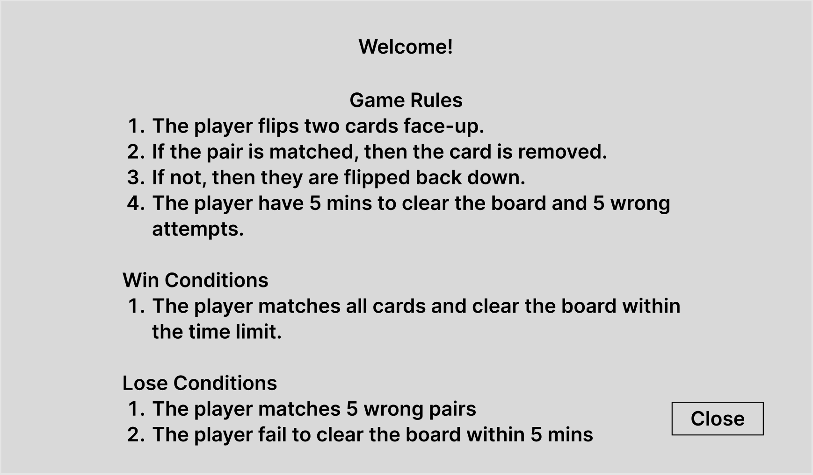
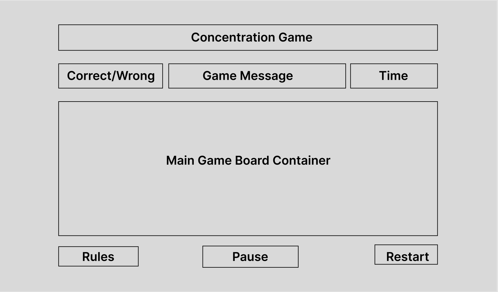
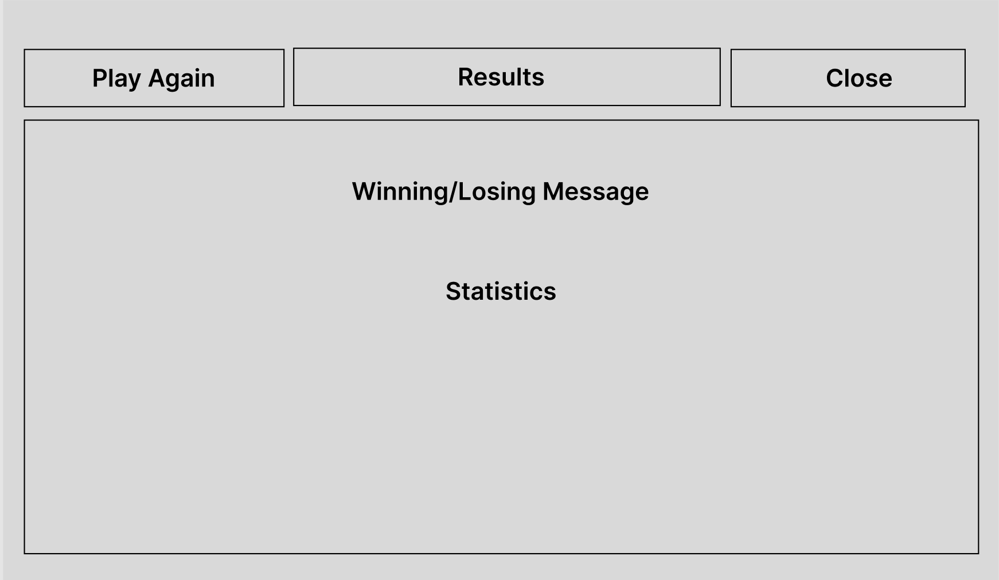
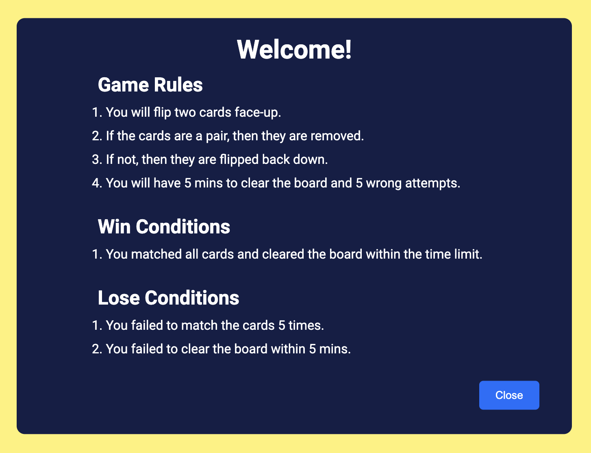
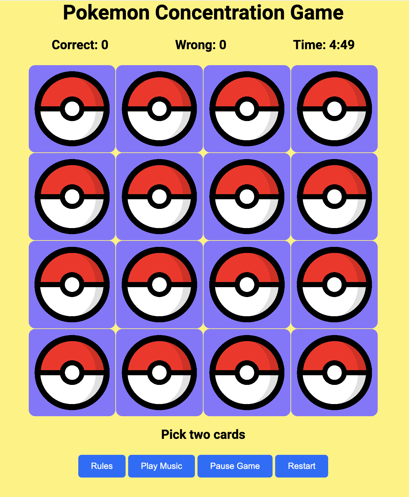
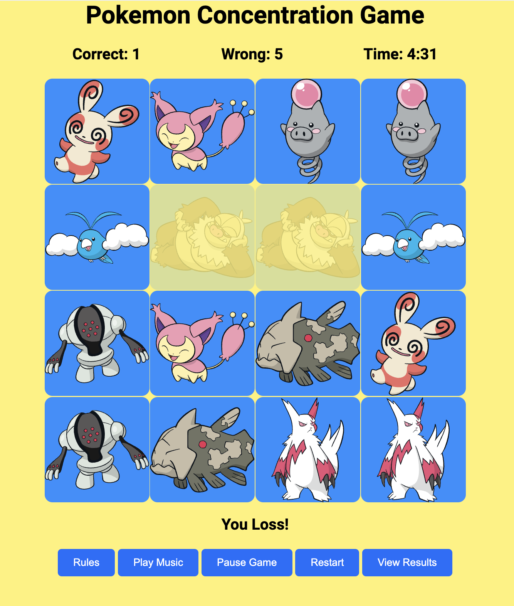
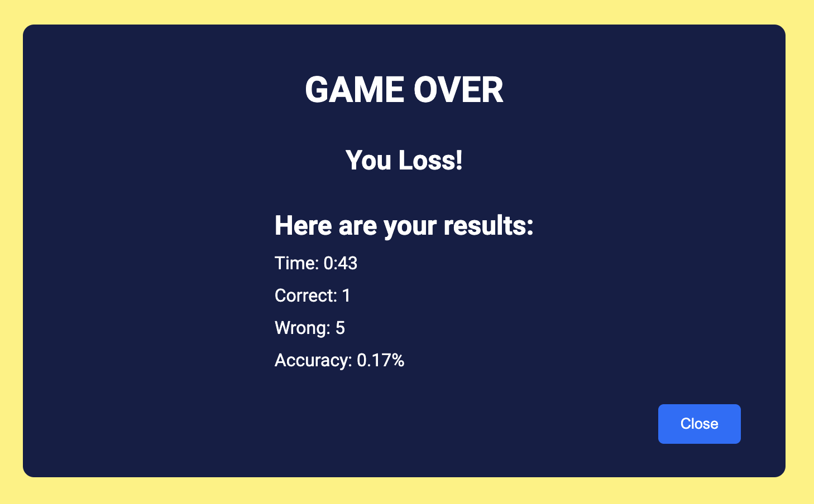

# Pokemon Memory Game

  

## :pencil: Descriptions:

This is a single-player memory game created using vanilla JavaScript, HTML, and CSS. The player will click on individual cards on the screen and try to match all cards to clear the board. All images are fetched using the Pokemon API. The goals of this project are to practice DOM manipulation techniques, CSS animations, and making API calls.

## 🎮: Getting Started:

You can access the game by clicking the link [here](https://debiddo618.github.io/pokemon-memory-game/).

## :bust_in_silhouette: Attributions:

The documentation for the Pokemon API can be found with this [link](https://pokeapi.co/docs/v2).

## :blue_book: Wireframes:

These are some page blueprints made using Figma to guide the development process.

## :camera_flash: Game Images:

## :computer: Technologies Used:

## :satellite: Next Steps:

Here are some potential improvements to the project:

- Add new layouts using CSS grid
- Add more levels to the game
- Add animations to the gameboard before game starts and after game ends
- Compatibility with mobile devices
